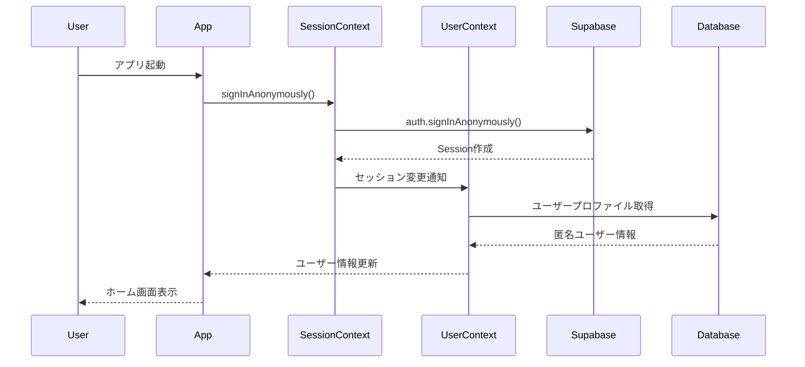
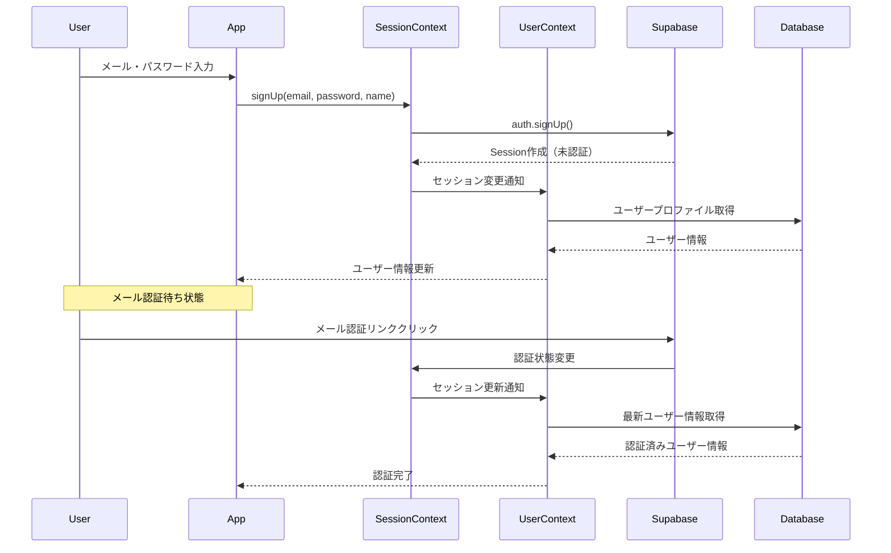
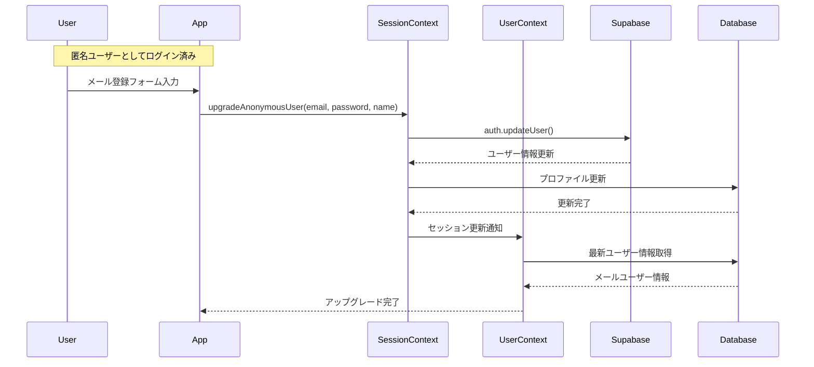
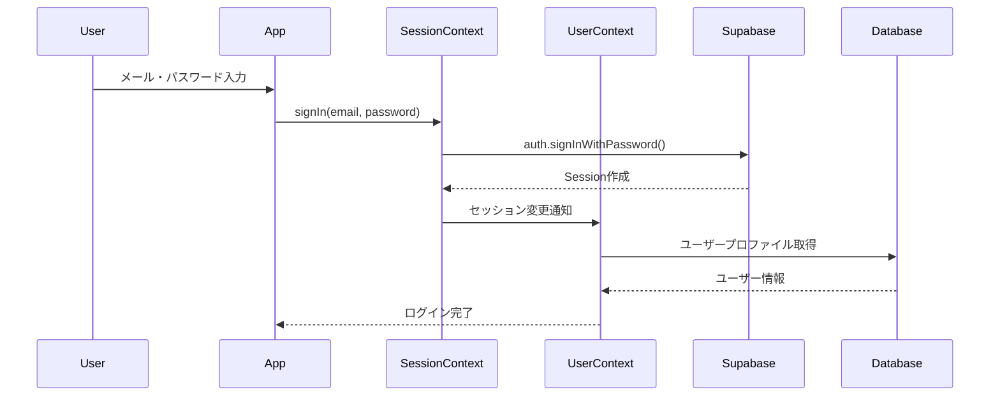

# 認証システム設計ドキュメント

## 概要

うさこワークでは、SupabaseのAuth機能を基盤とした認証システムを採用しています。認証状態管理とユーザーデータ管理を分離し、React Contextパターンを用いてアプリケーション全体で状態を共有しています。

## アーキテクチャ

### 責務の分離

認証システムは2つのContextに分離されています：

```
┌─────────────────┐    ┌─────────────────┐
│  SessionContext │    │   UserContext   │
│                 │    │                 │
│ ・認証状態管理   │    │ ・ユーザー情報   │
│ ・ログイン      │    │ ・プロフィール   │
│ ・ログアウト    │    │ ・世帯情報      │
│ ・セッション    │    │ ・更新機能      │
└─────────────────┘    └─────────────────┘
         │                        │
         └────────┬─────────────────┘
                  │
                  ▼
         ┌─────────────────┐
         │  App Components │
         └─────────────────┘
```

### SessionContext（認証状態管理）

**責務**: Supabase Authの直接的な管理

```typescript
interface SessionContextType {
  session: Session | null;
  isAuthLoading: boolean;
  signIn: (email: string, password: string) => Promise<void>;
  signUp: (email: string, password: string, name: string) => Promise<void>;
  signInAnonymously: () => Promise<void>;
  upgradeAnonymousUser: (email: string, password: string, name: string) => Promise<void>;
  signInWithGoogle: () => Promise<void>;
  signOut: () => Promise<void>;
  refreshSession: () => Promise<void>;
}
```

### UserContext（ユーザーデータ管理）

**責務**: アプリケーション固有のユーザー情報管理

```typescript
interface UserContextType {
  user: AuthUser | null;
  isUserLoading: boolean;
  updateUser: (updates: Partial<AuthUser>) => Promise<void>;
  refreshUser: () => Promise<void>;
}
```

## 認証フロー

### 1. 匿名ユーザー登録フロー



### 2. メールユーザー登録フロー



### 3. 匿名ユーザーのアップグレードフロー



### 4. ログインフロー



## ユーザータイプ

### 匿名ユーザー（Anonymous User）

- **特徴**: メールアドレス不要で即座に利用開始
- **制限**: デバイス依存、データバックアップなし
- **用途**: アプリの機能を試用する段階

```typescript
{
  id: "anonymous-user-id",
  name: "Anonymous User",
  hasCompletedOnboarding: false,
  householdId: null,
  // email なし
}
```

### メールユーザー（Email User）

- **特徴**: メールアドレスとパスワードで管理
- **利点**: デバイス間でのデータ同期、パスワードリセット可能
- **認証状態**: メール認証前後で機能制限あり

```typescript
{
  id: "email-user-id",
  name: "Test User",
  hasCompletedOnboarding: true,
  householdId: "household-id",
  email: "test@example.com" // SessionのUser情報に含まれる
}
```

## 認証状態の管理

### セッション状態

| 状態 | session | user | 説明 |
|------|---------|------|------|
| 未認証 | null | null | 初期状態またはログアウト後 |
| 匿名認証 | Session(anonymous=true) | AnonymousUser | 匿名ユーザーとしてログイン |
| 未認証メール | Session(email_confirmed_at=null) | EmailUser | メール認証待ち |
| 認証済み | Session(email_confirmed_at!=null) | EmailUser | 完全認証済み |

### ローディング状態

- **isAuthLoading**: Supabaseセッションの取得・認証処理中
- **isUserLoading**: ユーザープロファイル情報の取得・更新中

```typescript
// 初期化完了の判定
const isInitialized = !isAuthLoading && !isUserLoading;

// 認証が必要な画面への遷移判定
const canAccessApp = isInitialized && session;

// ユーザー情報が必要な操作の判定
const canAccessUserFeatures = canAccessApp && user;
```

## 世帯システムとの連携

### オンボーディング状態

```typescript
interface AuthUser {
  hasCompletedOnboarding: boolean; // 世帯参加済みかどうか
  householdId: string | null;      // 参加中の世帯ID
}
```

### 世帯参加フロー

1. **新規世帯作成**: 
   - ユーザーが世帯を作成
   - 自動的に世帯管理者として参加
   - `hasCompletedOnboarding = true`

2. **既存世帯参加**:
   - 招待コードで世帯参加
   - メンバーとして追加
   - `hasCompletedOnboarding = true`

3. **世帯未参加**:
   - アカウント作成済みだが世帯未参加
   - `hasCompletedOnboarding = false`
   - オンボーディング画面を表示

## エラーハンドリング

### 認証エラー

```typescript
// SessionContextでのエラーハンドリング
try {
  await signIn(email, password);
} catch (error) {
  // getAuthErrorMessage()でユーザーフレンドリーなメッセージに変換
  setError(getAuthErrorMessage(error));
}
```

### ユーザー情報エラー

```typescript
// UserContextでのエラーハンドリング
const fetchUser = async (userId: string) => {
  try {
    const userData = await fetchUserWithHousehold(userId);
    if (!userData) {
      // ユーザーレコードが存在しない場合は自動サインアウト
      await signOut();
      return;
    }
    setUser(userData);
  } catch (error) {
    console.error('Failed to fetch user:', error);
    // エラーログのみ、ユーザーには表示しない
  }
};
```

## セキュリティ考慮事項

### Row Level Security (RLS)

- 全てのテーブルでRLSポリシー有効
- ユーザーは自身のデータのみアクセス可能
- 世帯データは世帯メンバーのみアクセス可能

### セッション管理

- Supabaseの自動トークンリフレッシュ機能を利用
- セッション期限切れ時の自動サインアウト
- セキュアなトークン保存（expo-secure-store）

### データ削除

- アカウント削除時の関連データ自動削除
- 外部キー制約による整合性保証
- 削除権限の厳格な管理

## 使用方法

### 基本的な使用例

```typescript
import { useSession } from '@/lib/contexts/SessionContext';
import { useUser } from '@/lib/contexts/UserContext';

const MyComponent = () => {
  const { session, isAuthLoading, signOut } = useSession();
  const { user, isUserLoading } = useUser();

  if (isAuthLoading || isUserLoading) {
    return <LoadingSpinner />;
  }

  if (!session) {
    return <LoginScreen />;
  }

  if (!user?.hasCompletedOnboarding) {
    return <OnboardingScreen />;
  }

  return (
    <View>
      <Text>Welcome, {user.name}!</Text>
      <Button title="Logout" onPress={signOut} />
    </View>
  );
};
```

### プロバイダーの設定

```typescript
// app/_layout.tsx
export default function RootLayout() {
  return (
    <SessionProvider>
      <UserProvider>
        <AppNavigator />
      </UserProvider>
    </SessionProvider>
  );
}
```

### 認証が必要な画面での使用

```typescript
import { AuthRequired } from '@/lib/types/auth';

const ProtectedScreen: AuthRequired = () => {
  const { user } = useUser();
  
  // この時点で user は必ず存在することが型で保証される
  return (
    <View>
      <Text>Hello, {user.name}</Text>
    </View>
  );
};
```

## テスト戦略

### 単体テスト

- SessionContext単体のテスト
- UserContext単体のテスト
- AuthService関数のテスト

### 統合テスト

- SessionContextとUserContextの協調動作
- 認証フロー全体のテスト
- エラーハンドリングのテスト

### E2Eテスト

- ユーザー登録からログインまでの一連のフロー
- 匿名ユーザーのアップグレードフロー
- 世帯参加フローとの組み合わせ

## トラブルシューティング

### よくある問題

1. **セッションはあるがユーザー情報がない**
   - ユーザーレコードが作成されていない可能性
   - データベースのRLSポリシーを確認

2. **認証後にユーザー情報が更新されない**
   - UserContextのセッション変更監視を確認
   - fetchUserWithHouseholdの実装を確認

3. **匿名ユーザーのアップグレードに失敗**
   - 現在のユーザーが匿名ユーザーか確認
   - メールアドレスの重複を確認

### デバッグ方法

```typescript
// 開発環境でのデバッグログ
if (__DEV__) {
  console.log('Session:', session);
  console.log('User:', user);
  console.log('Auth Loading:', isAuthLoading);
  console.log('User Loading:', isUserLoading);
}
```

## 今後の拡張予定

- ソーシャルログイン（Google、Apple）の完全実装
- 多要素認証（MFA）のサポート
- パスワードレス認証の導入
- デバイス管理機能
- セッション管理の改善（複数デバイス対応）